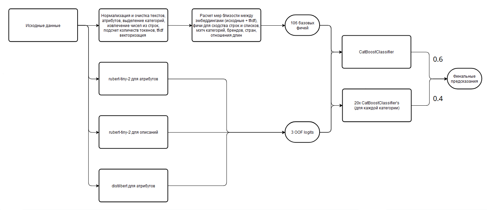

# MISIS Neychev Loss 

## Состав команды: 
1) [**Груздев Александр**](https://github.com/gruzdev-as) - ML
2) [**Рыжичкин Кирилл**](https://github.com/l1ghtsource) - ML
3) [**Литвинов Максим**](https://github.com/maksimlitvinov39kg) - ML 
4) [**Аксеновский Максим**](https://github.com/Solitum26) - ML
5) [**Замышевская Арина**](https://github.com/Nimbleredsquirrel) - ML

Презентация: [тык](https://drive.google.com/file/d/1-L61ooSwS0bSlZIfT1Uk5YO9XHGkVnjc/view?usp=sharing)

## Описание решения 

Итоговое решение представляет собой ансамбль из градиентных бустингов, обученных с применением признаков, полученных без использования моделей глубокого обучения и с использованием различных модификаций модели BERT. Для каждого тестового семпла делается два предсказания: 

1) Предсказание от 5 моделей, которые обучались на всех тренировочных данных с различными сидами, чтобы исключить влияние рандома
2) Предсказание от 5 моделей, которые обучались на данных из конкретной категории второго уровня с различными сидами  

Итоговые предсказания моделей суммируются и усредняются, а после блендятся с весами $w_{full} = 0.6$ и $w_{categories} = 0.4$, получая финальное предсказание. 
Каждая модель градиентного бустинга использует **109** признаков, из которых **106** признаков получены используя имеющиеся данные без использования моделей машинного обучения, как это продемонстрированно в файле [**generate_features_train.py**](generate_features_train.py), а **3** признака - OOF предсказания, полученные от дообученных open-source моделей.



### Используемые Open-Source модели

1) [**rubert-tiny-2**](https://huggingface.co/cointegrated/rubert-tiny2)
2) [**distilbert-base-multilingual-cased**](https://huggingface.co/distilbert/distilbert-base-multilingual-cased)

Модель **rubert-tiny-2** использовалась для генерации OOF признаков по атрибутам и по описаниям товара, соответственно. Модель **distilbert-base-multilingual-cased** использовалась для генерации OOF признаков только по атрибутам.

Код обучения моделей и получения OOF предсказаний: [**тык**](bert_training.py)

Веса моделей, используемые для инференса: 
1) [**3epoch_768_name_attr_bert_full**](https://drive.google.com/file/d/1GEI0lEi1gitio-aKdn0fdAni-sHMhZlB/view?usp=drive_link)
2) [**3epoch_1024_name_desc_bert_full**](https://drive.google.com/file/d/1vMe_znzoKJjUZ7gRRTQDpbch_5Nx98e6/view?usp=drive_link)
3) [**multi512_attr_bert_full_second_epoch**](https://drive.google.com/file/d/1c9d03-pIwT5HJWfvEQ8PlxW5GtaEkuTB/view?usp=drive_link)

Модели градиентного бустинга: 
[Ссылка для скачивания](https://drive.google.com/drive/folders/1mktUxSWbg1YQHZXdSjQyBoSqwlD2pNdl?usp=drive_link)

### Получение финальных моделей 

Процедура обучения моделей градиентного бустинга описана в файле [**train_boosting_models.py**](train_boosting_models.py) для общей модели и для категориальных моделей. 

## Итоговый пайплайн для воспроизведения решения 

В процессе хакатона командой использовались следующие ресурсы для обучения моделей и генерации признаков: 
1) VK CLOUD SERVER, 128 Gb RAM 16 CPU Intel Ice Lake;
2) Kaggle GPU accelerated environment (P100);
3) Персональные компьютеры (ПК) членов команды.

В связи с этим, для воспроизведения полного пайплайна рекомендуется убедиться, что ресурсов системы достаточно. Так как, например, во время генерации признаков на тренировочном датасете может сильно скакать потребление памяти и, следовательно, объем затраченного времени. 

*Команда приносит свои извинения за то, что код не идеально оптимизирован, и занимает так много времени для генерации признаков для тренировки*

Чтобы воспроизвести решение: 
1) Создайте виртуальное окружение, активируйте его и установите необходимые библиотеки
    ```bash 
        python -m venv venv
        source venv/bin/cativate
        pip install -r requirements.txt
    ```

2) Убедитесь, что в репозитории находится папка *data*, имеющая следующую структуру: 
    ```
    /project-root-folder
    ├── data
    │   ├── train
    │   │   ├── train.parquet
    │   │   ├── attributes.parquet
    │   │   ├── text_and_bert.parquet
    │   │   ├── resnet.parquet
    │   ├── test
    │   │   ├── test.parquet
    │   │   ├── attributes_test.parquet
    │   │   ├── text_and_bert_test.parquet
    │   │   ├── resnet_test.parquet
    ```
    
2) Запустите файл [**generate_features_train.py**](generate_features_train.py)
    1) Запустится генерация признаков на основе тренировочных данных (Файл [**generate_features_train.py**](generate_features_train.py), вызовет последовательно файлы [**data_preprocessing.py**](data_preprocessing.py) и [**feature_generation.py**](feature_generation.py))
    2) Полученные паркеты с данными будут сохранены в *data/train/*. 

3) Запустите файл [**bert_training.py**](bert_training.py)    
    1) Запустится обучение open_source моделей 
    2) Веса моделей будут сохранены в *models/BERT/*

4) Запустите файл [**train_boosting_models.py**](train_boosting_models.py)
    1) Запустится скрипт обучения моделей градиентного бустинга на основе ранее полученных паркетов
    2) Полученные модели будут сохранены в *models/CATBOOST* (общая модель) и в *models/CATBOOST/categories* (модели для категорий)

5) Запустите файл [**make_submission.py**](make_submission.py)
    1) В папке *data* будет создан файл *submission.csv*, содержаший предсказания вероятностей для каждой пары из *test.parquet*

### Прочие файлы и папки, примечания

1) Для инференса через систему CI/CD веса моделей бустинга пушились прямо в репо, веса "тяжелых" моделей и обученные векторизаторы скачивались во время сборки docker контейнера. В связи с этим, для инференса можно скачать необходимые веса и модели напрямую. Также для локального инференса open_source моделей необходимо или скачать их базовые pretrained версии вручную по ссылкам, либо использовать команды: 
```bash 
    huggingface-cli download cointegrated/rubert-tiny2 --local-dir='./models/basemodel/rubert' && \ 
    huggingface-cli download distilbert-base-multilingual-cased --local-dir='./models/basemodel/distilbert'
```
Если команда выдает ошибку, то установите huggingface-cli 
```bash 
    pip install huggingface-hub
```

2) Папка *notebooks* содержит ноутубки, которые могут содержать куски кода для обучения признаков и/или моделей, которые не вошли в итоговое рещение. Они прикладываются исключительно с целью ознакомления и, скорее всего, могут содержать ошибки:

- [Exploratory Data Analysis](notebooks/0.%20Exploratory%20Data%20Analysis.ipynb) - содержит разведочный анализ данных
- [Preprocessing & Feature Generation for Train](notebooks/1.1%20Preprocessing%20&%20Feature%20Generation%20for%20Train.ipynb) - генерация основных признаков для обучающей выборки
- [Preprocessing & Feature Generation for Test](notebooks/1.2%20Preprocessing%20&%20Feature%20Generation%20for%20Test.ipynb) - генерация основных признаков для тестовой выборки
- [Bert (Name + Attrs) OOF Predictions](notebooks/2.1%20Bert%20(Name%20+%20Attrs)%20OOF%20Predictions.ipynb) - получение OOF предсказаний BERT по атрибутам
- [Bert (Name + Attrs) Full Training](notebooks/2.2%20Bert%20(Name%20+%20Attrs)%20Full%20Training.ipynb) - полное обучение модели BERT на атрибутах
- [Bert (Name + Desc) OOF Predictions](notebooks/3.1%20Bert%20(Name%20+%20Desc)%20OOF%20Predictions.ipynb) - получение OOF предсказаний BERT по описаниям
- [Bert (Name + Desc) Full Training](notebooks/3.2%20Bert%20(Name%20+%20Desc)%20Full%20Training.ipynb) - полное обучение модели BERT на описаниях
- [Bert Inference](notebooks/4.%20Bert%20Inference.ipynb) - пример инференса BERT
- [FastText Training](notebooks/%5BUNUSED%5D%20FastText%20Training.ipynb) - обучение FastText модели на описаниях
- [Sampling from Train Dataset](notebooks/%5BUNUSED%5D%20Sampling%20from%20Train%20Dataset.ipynb) - сэмплирование выборки, похожей на тестовую по распределению категорий трёх уровней, из обучающей выборки
- [Siamese Bert (Name + Attrs) Training](notebooks/%5BUNUSED%5D%20Siamese%20Bert%20(Name%20+%20Attrs)%20Training.ipynb) - обучение представлений для атрибутов товаров на примере сиамской нейросети
- [Siamese Bert (Name + Desc) Training](notebooks/%5BUNUSED%5D%20Siamese%20Bert%20(Name%20+%20Desc)%20Training.ipynb) - обучение представлений для описаний товаров на примере сиамской нейросети
- [Transitive Chains](notebooks/%5BUNUSED%5D%20Transitive%20Chains.ipynb) - расширение обучающей выборки с помощью транзитивных цепочек

## Запуск через докер-контейнер 

Запустить решение возможно используя функционал docker. Для того, чтобы собрать образ решения выполните 

```bash
docker build . -t matching_object
```

После сборки контейнера вы можете запустить инференс используя команду 

```bash 
docker run -it --network none --shm-size 2G --name matching_object -v ./data:/app/data matching_object python make_submission.py
```

Также внутри докер контейнера есть возможность запускать другие .py файлы решения, используя, соответственно 

```bash 
docker run -it --network none --shm-size 2G --name matching_object -v ./data:/app/data matching_object python {sciptname.py}
```

Однако, в виду того, что при сборке контейнера скачиваются все веса и библиотеки, запуск может занимать много времени. 